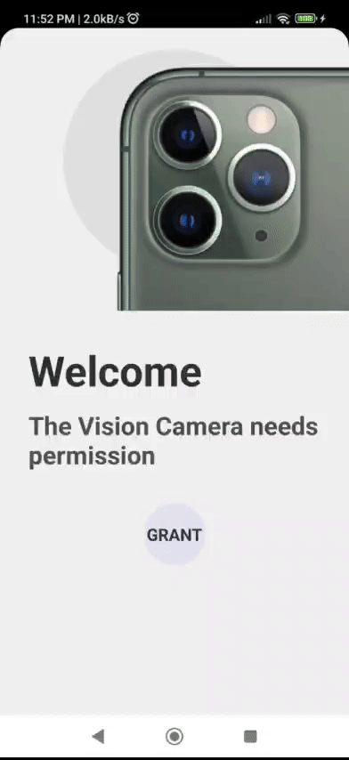

# Demo Test - Vision Camera Plugin from React Native

This project is a [React Native](https://facebook.github.io/react-native/) mobile application.
The project contains the image capture and its respective saving in the local gallery.

- Enable/Disable Camera Flash
- Front camera change
- Activate/Deactivate Night Mode
- Activate/Deactivate HDR
- Modify FPS (30/60)
- In addition, it requires permissions to use the camera and read files in the gallery.

NOTE: Each of the above options has its validation if the device can opt for the functionality and grants the corresponding permissions.

## Screens Previews

<table style="border: 0">
  <tr>
    <td align="center"></td>
  </tr>
</table>

## Requirements

Node 18 or greater is required.
Development for iOS requires a Mac and Xcode 10 or up, and will target iOS 11 and up.

You also need to install the dependencies required by React Native.  
Go to the [React Native environment setup](https://reactnative.dev/docs/environment-setup), then select `React Native CLI Quickstart` tab.  
Follow instructions for your given `development OS` and `target OS`.

## Technologies

- [Yarn](https://yarnpkg.com/) (v1 or newer)
- [Git](https://git-scm.com/)
- [React Native (0.73.4)](https://reactnative.dev): Used for building the native app with React.
- [React (18.2.0)](https://react.dev/): Empowers the native app with React.
- [React Native MMKV (^2.12.1)](https://github.com/mrousavy/react-native-mmkv): A highly efficient and compact mobile key-value storage solution.
- [React Navigation (^6.1.10)](https://reactnavigation.org/): Handles routing and navigation within the app, featuring a default splash screen setup.

## Quick start

To get a local copy of this project up and running, follow the steps below.
Assuming you have all the requirements installed, you can run the project by running:

- Clone the repository:
  `git clone https://github.com/iJesusApm/RN-vision-camera.git`
- Navigate into the project directory:
  `cd RN-vision-camera`
- Install the dependencies:
  `yarn install` or `npm install`
- if u wanna run ios, please run first:
  `cd ios && pod instal && cd ..`
- Run the app on Android:
  `yarn android` or `npm run android`
- Run the app on iOS
  `yarn ios` or `npm run ios`

### REMEMBER

- `yarn start` to start the metro bundler, in a dedicated terminal
- `yarn <platform>` to run the _platform_ application (remember to start a simulator or connect a device)

## Project Structure

From src:

- components/: Home to application components, following the atomic design methodology for organizing presentational components.
- hooks/: Custom hooks used throughout the application.
- navigators/: Navigator components responsible for handling navigation.
- screens/: Screen components representing various app screens.
- theme/: Holds theme configuration for the application.
- types/: Custom type definitions for the project.
- App.tsx: the main entry point of the app.

## Digging Deeper

The objective of this project is the development of a mobile application in React Native that when opened turns on the plugin camera
vision camera [(Getting Started | VisionCamera (react-native-vision-camera.com))](https://react-native-vision-camera.com/docs/guides/) for the photo capture.

I used the following boilerplate for the initial configuration and project structure, if u want to learn more about this boilerplate, go to [full documentation](https://thecodingmachine.github.io/react-native-boilerplate)
